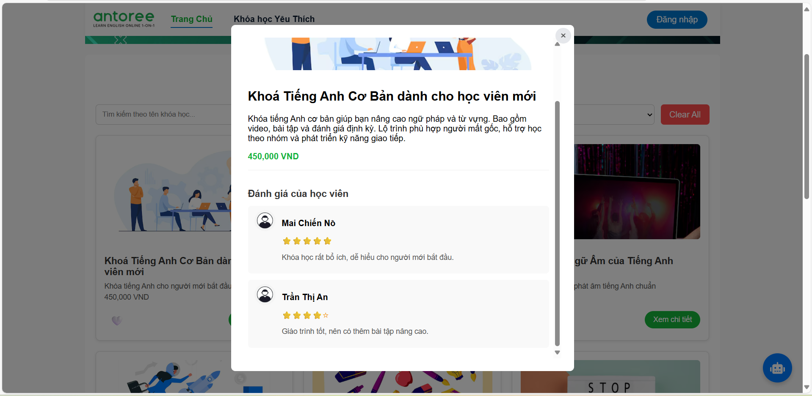
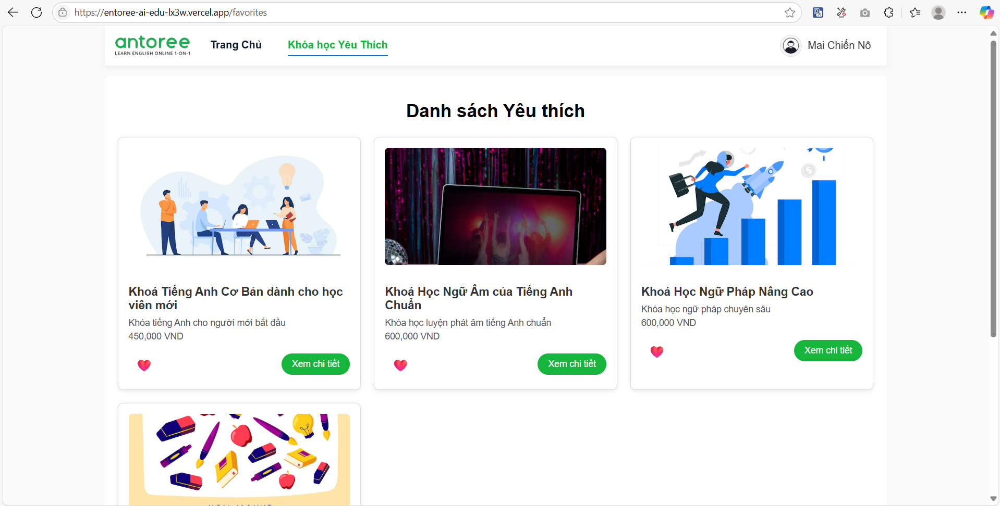
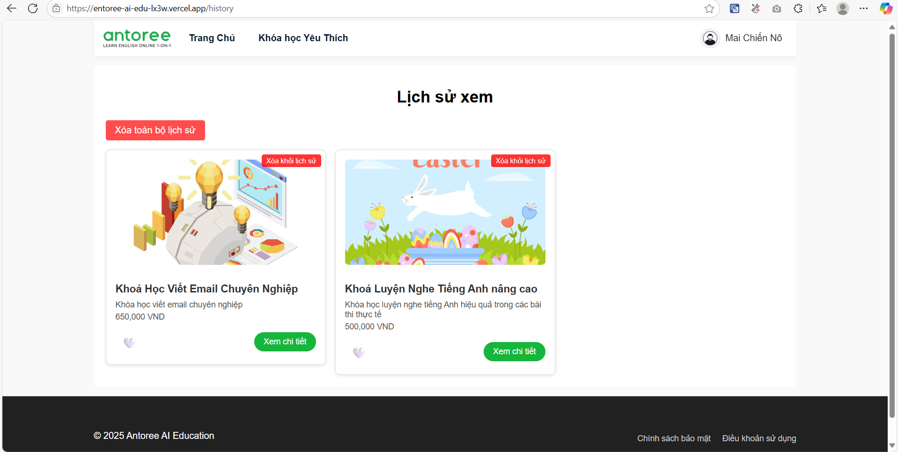
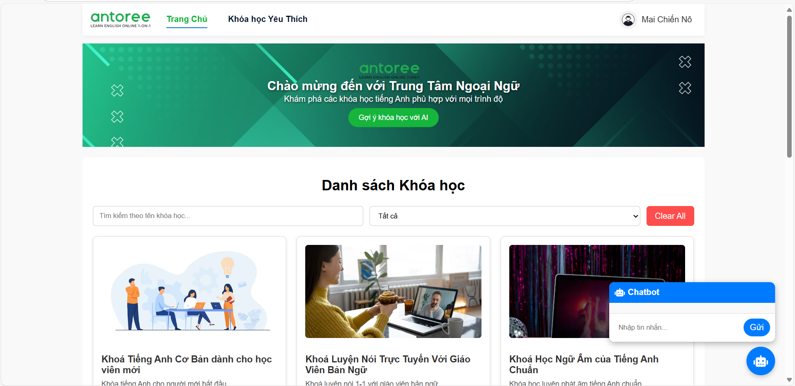

# 🏫 Sàn Giáo Dục Thương Mại Điện Tử Tích Hợp AI


---

## 📌 Giới thiệu

Đây là dự án **Front-end mô phỏng sàn giáo dục thương mại điện tử tích hợp AI**, nơi người dùng có thể:  
✅ Tìm kiếm & lọc sản phẩm  
✅ Xem chi tiết qua modal trực quan  
✅ Thêm sản phẩm vào danh sách yêu thích  
✅ Nhận **gợi ý thông minh (AI)** dựa trên hành vi người dùng  
✅ **Lịch sử xem** sản phẩm đã từng click  
✅ Trò chuyện với **Chatbot AI** để được tư vấn sản phẩm

Giao diện hiện đại, **responsive trên mọi thiết bị**, trải nghiệm mượt mà.

---

## 🚀 Demo

### ✅ **1. Front-end (FE)**
👉 **[https://entoree-ai-edu-lx3w.vercel.app](https://entoree-ai-edu-lx3w.vercel.app)**

### ✅ **2. Back-end (Chatbot AI)**
👉 **[https://antoree-chatbot-backend-r5ipog.fly.dev](https://antoree-chatbot-backend-r5ipog.fly.dev)**

### ✅ **3. Video Demo**
👉 **[Xem video demo](https://drive.google.com/file/d/1HvNO_MxIo342UZNFLWbVbYFj4pnDifaj/view?usp=sharing)**

---

## 🖼️ Hình minh hoạ

### **Users Data**


### **Trang chủ**


### **Modal chi tiết sản phẩm**


### **Danh sách yêu thích**


### **Lịch sử xem**


### **Chatbot AI**


---

## 🎯 Chức năng chính

✔ **Danh sách sản phẩm**: tên, giá, ảnh, mô tả ngắn, nút "Xem chi tiết"  
✔ **Tìm kiếm & lọc sản phẩm** theo tên, giá  
✔ **Gợi ý thông minh (AI)** dựa trên hành vi người dùng  
✔ **Quản lý yêu thích**: thêm/xóa, danh sách yêu thích riêng  
✔ **Lịch sử xem**: hiển thị danh sách sản phẩm đã click  
✔ **Chatbot AI tư vấn sản phẩm** *(Bonus)*  
✔ **Loading skeleton** & xử lý lỗi API  

---

## 🧩 Công nghệ

### **Front-end**
- **React + Vite** (SPA)
- **React Router**
- **TailwindCSS** (UI hiện đại)
- **Axios** (mock API)
- **React Toastify** (thông báo UX tốt)
- **LocalStorage** (lưu danh sách yêu thích & lịch sử xem)

### **Back-end**
- **Spring Boot + WebClient** (gọi OpenAI API)
- **Flo.io** (deploy backend miễn phí)

---

## 📱 Responsive
UI tương thích: **Desktop | Tablet | Mobile**  
Hiệu ứng hover & transition mượt mà.

---

## 🔧 Cách chạy dự án local

### **1. Front-end (React)**
npm run dev

#### Clone & cài đặt local
```bash
git clone https://github.com/MaiChienNoIUH/entoree-ai-edu.git
cd entoree-ai-edu
npm install
